# Лабораторная работа 6: Создание внутренней формы представления программы

## Название работы и автор

- **Работа:** Создание внутренней формы представления программы (ВПП)
- **Автор:** Васильев Антон Романович
- **Группа:** АВТ-314

## Цель работы

Изучить методы построения внутреннего представления программы (ВПП) на основе контекстно-свободной грамматики, реализовать синтаксический анализатор методом рекурсивного спуска и преобразовать арифметические выражения в тетрады и ПОЛИЗ.

## Постановка задачи

1. Реализовать поиск **лексических** и **синтаксических** ошибок для заданной КС-грамматики методом рекурсивного спуска.
2. Представить внутреннюю форму программы в виде **тетрад** `(op, arg1, arg2, result)` для арифметических выражений (только для корректных строк).
3. Преобразовать выражение в **ПОЛИЗ** и вычислить его значение (только для выражений из целых чисел).

---

## Вариант задания

- **Студент:** Васильев Антон Романович
- **Язык:** арифметические выражения

### Полное определение КС-грамматики

```text
E  → T A
A  → ε | + T A | - T A
T  → F B
B  → ε | * F B | / F B | % F B
F  → num | id | (E)
id → letter {letter | digit}
num → digit {digit}
```

**Приоритет операций:** `*`, `/`, `%` выше `+`, `-` (задаётся уровнями `T` и `E`).

### Примеры корректных строк

- `a + b * c`
- `(x + 12) / y - z % 3`
- `2 + 3 * (4 - 1)`
- `100 / (5 + 5) + 7`

---

## Реализация

Основной модуль: `lab6_expression_analyzer.py`

| Этап | Класс / функция | Описание |
|------|-----------------|----------|
| Лексический анализ | `Lexer` | Выделение `num`, `id`, операторов `+ - * / %`, скобок |
| Синтаксический анализ | `RecursiveDescentParser` | Рекурсивный спуск по правилам `E`, `A`, `T`, `B`, `F` |
| Тетрады | `RecursiveDescentParser.quads` | Генерация при разборе с временными `t1`, `t2`, … |
| ПОЛИЗ | `to_postfix` | Алгоритм Дейкстры (стек операций) |
| Вычисление | `eval_postfix` | Стековое вычисление (только целые числа) |

При наличии лексических или синтаксических ошибок разбор на тетрады и ПОЛИЗ **не выполняется** — выводится предупреждение.

---

## Лексические и синтаксические ошибки

### Обрабатываемые ошибки

| Тип | Пример | Сообщение |
|-----|--------|-----------|
| Лексическая | `a + @b` | Недопустимый символ |
| Лексическая | `1abc + 2` | Идентификатор, начинающийся с цифры |
| Синтаксическая | `5 + * 2` | Пропущен операнд |
| Синтаксическая | `(a + b` | Пропущена закрывающая скобка |
| Синтаксическая | `7 + 3)` | Лишняя закрывающая скобка / лишний фрагмент |

### Диаграмма лексера

```text
                    ┌─────────────┐
                    │    START    │
                    └──────┬──────┘
           ┌───────────────┼───────────────┬──────────────┐
           │               │               │              │
      digit│          letter│         + - * / %│      ( )   │  other
           ▼               ▼               ▼              ▼      ▼
      ┌─────────┐    ┌─────────┐    ┌─────────┐   ┌─────────┐ ┌──────────┐
      │   NUM   │    │   ID    │    │   OP    │   │  LPAREN │ │ LEX_ERROR│
      │ digit*  │    │letter   │    │         │   │  RPAREN │ └──────────┘
      └────┬────┘    │{l|d}*   │    └─────────┘   └─────────┘
           │         └─────────┘
     letter│
           ▼
      ┌──────────┐
      │ LEX_ERROR│  (1abc — id с цифры)
      └──────────┘

      whitespace → пропуск, возврат в START
```

### Схема рекурсивного спуска для парсера

```text
parse:
  E
  expect EOF

E:
  T
  A

A:
  if '+' or '-':
     consume op
     T
     emit quad(op, left, right, tN)
     A
  else ε

T:
  F
  B

B:
  if '*' or '/' or '%':
     consume op
     F
     emit quad(op, left, right, tN)
     B
  else ε

F:
  num  → return value
  id   → return value
  '('  → E, expect ')', return inner
  else → syntax error
```

### Скриншоты: лексер и парсер

**1. Корректная цепочка — лексический и синтаксический анализ**

Вход: `2 + 3 * (4 - 1)`

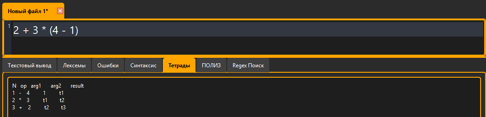
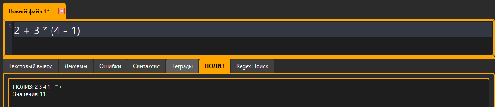

**2. Лексическая ошибка — недопустимый символ**

Вход: `a + @b`

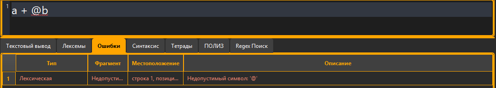
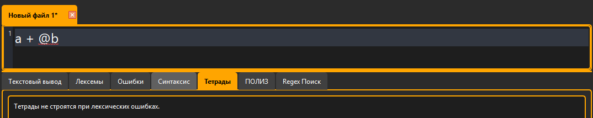
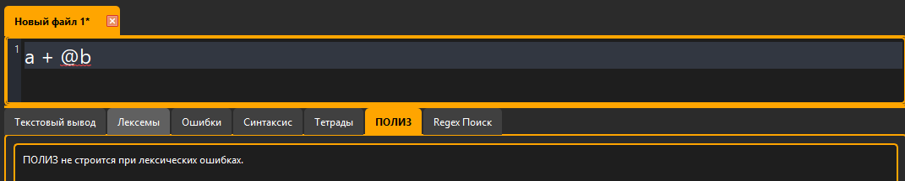

**3. Лексическая ошибка — идентификатор с цифры**

Вход: `1abc + 2`

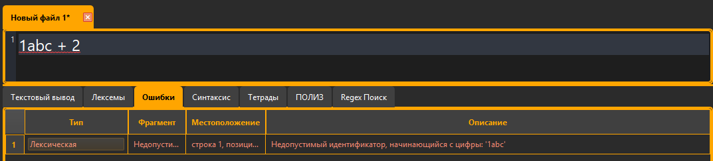

**4. Синтаксическая ошибка — пропущенный операнд**

Вход: `5 + * 2`

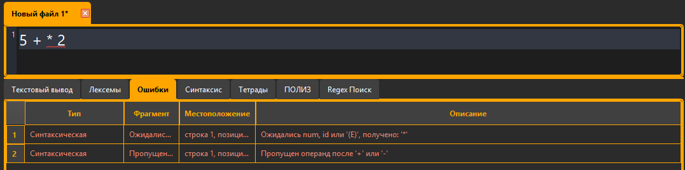

**5. Синтаксическая ошибка — лишняя скобка**

Вход: `7 + 3)`

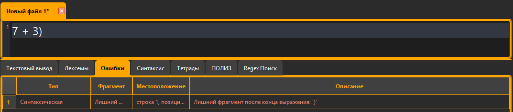

**6. Синтаксическая ошибка — пропущенная скобка**

Вход: `(a + b`

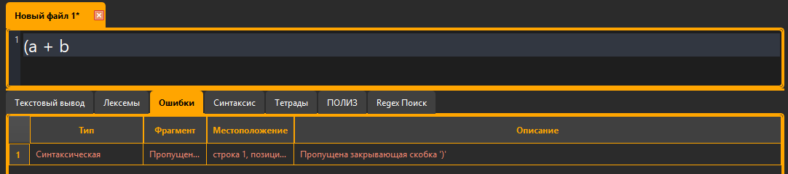

---

## Внутренняя форма представления программы (тетрады)

Тетрады генерируются **во время синтаксического разбора** для корректных выражений без ошибок.

Формат: `(op, arg1, arg2, result)`, временные переменные `t1`, `t2`, …

### Пример

Вход: `2 + 3 * (4 - 1)`

| N | op | arg1 | arg2 | result |
|---|-----|------|------|--------|
| 1 | -   | 4    | 1    | t1     |
| 2 | *   | 3    | t1   | t2     |
| 3 | +   | 2    | t2   | t3     |

### Скриншот таблицы тетрад

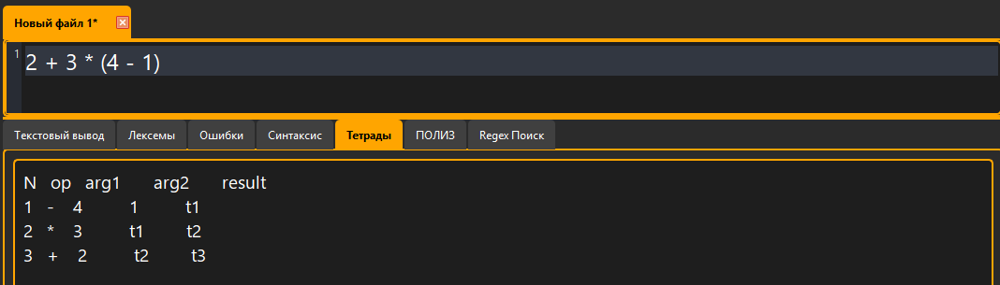

---

## ПОЛИЗ

ПОЛИЗ строится алгоритмом Дейкстры **только** для выражений, состоящих **исключительно из целых чисел** (без идентификаторов).

### Пример

Вход: `2 + 3 * (4 - 1)`

- **ПОЛИЗ:** `2 3 4 1 - * +`
- **Значение:** `11`

Приоритет: `*` выше `+` (сначала `4 - 1`, затем `3 * t1`, затем `2 + t2`).

### Скриншот формирования ПОЛИЗ и вычисления

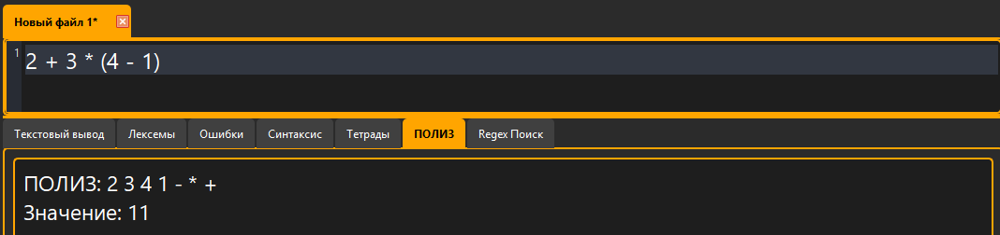

---

## Вывод

В ходе работы реализован лексический и синтаксический анализатор арифметических выражений методом рекурсивного спуска по индивидуальной КС-грамматике. Для корректных цепочек строятся тетрады с временными переменными; для выражений из целых чисел формируется ПОЛИЗ алгоритмом Дейкстры с последующим вычислением. При ошибках генерация ВПП блокируется.
